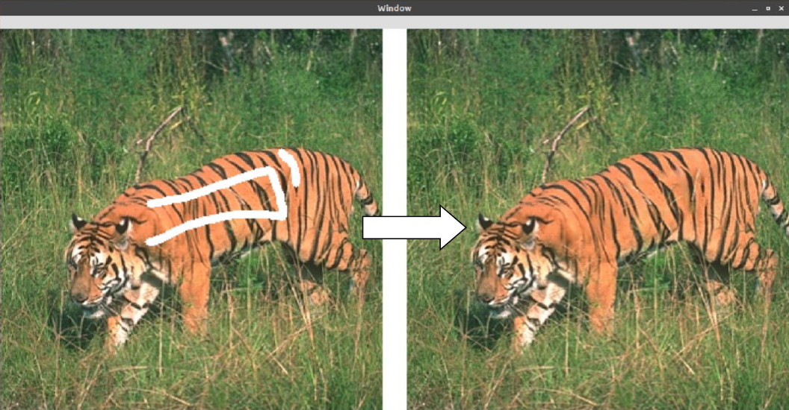

# Image-Reconstruction
--This project is about reconstruction a corrupt image using AI--

Inspired from "General Deep Image Completion with Lightweight Conditional Generative Adversarial Networks" by Ching-Wei Tseng, Hung Jin Lin and Shang-Hong Lai.

This project was my academic project and did not used in any production.

Image processing is a method to convert an image into digital form and perform some operations on it, in order to get an enhanced image or to extract some useful information from it. So here, in this project we are using neural network model for image processing. As neural network has number of applications in this field like geotechnics, industrial surveillance, defence department etc.
The following processes are used in managing images with neural networks:
1) Image preprocessing
2) Data reduction
3) Segmentation
4) Recognition
These processes lead towards the regenerated image.
As the image is considered as a function on spatial domain, it has a limited scale of numeric value (N, R, Complex no.s ) which can be treated as a matrix for further processing.

Image impainting and completion are classical problems in computer vision and graphics. The objective is to fill semantic and reasonable contents to the corruptions (missing regions) in an image. Humans can fill the missing regions by the empirical knowledge to the diverse object structures from the real world. Nevertheless, it is not easy for machines to learn a wide variety of structures in natural images and predict what to fill in unknown missing-data regions in images. Thus, it is crucial to know how to learn an image transformation from a corrupted image with missing data to a completed image.

NOTE : While feeding the image to the model, make sure that the image has been resized to 320x320 since the model is trained with this feature size.

Extract Weights

OUTPUT-1

OUTPUT-2

